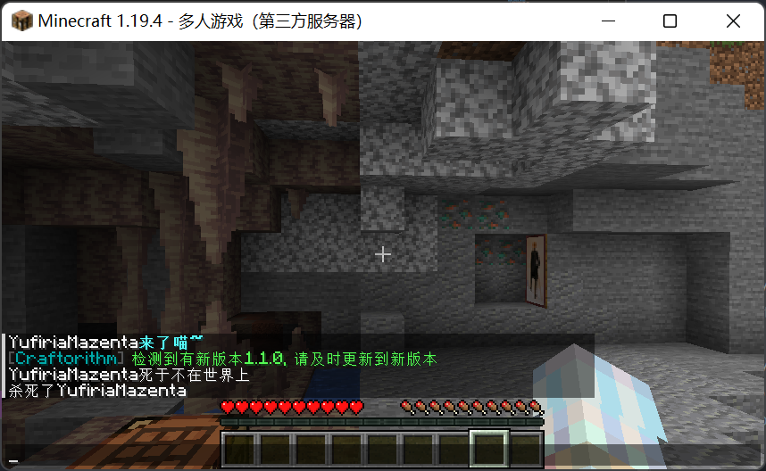

<div align="center">
<h1>DeathMessage</h1>
<h6>自定义玩家死亡消息</h6>
</div>

## 效果说明

服主自定义玩家的死亡消息，支持颜色代码。

## 效果展示



## 使用方法

在配置文件中修改对应死亡类型的消息即可，`%dead_player%`代表死者，如果有击杀者则`%killer%`代表击杀者，如果击杀者使用物品击败则`%kill_item%`代表该物品。

### 跨服

在需要跨服的服务器安装本插件,并打开`config.yml`中的`proxy`即可

### 指令

`/deathmessagereload`简写`/dmrl`，作用是重新加载配置文件

权限节点`deathmessage.command.reload`

`/deathmessagefilter`简写`/dmf`，作用是开启/关闭死亡消息屏蔽，参数`on/off`

无权限节点

### 配置文件

```yaml
player_name_format: "%player_displayname%"
#死亡消息展示的地方，支持chat（聊天栏）和action_bar（物品栏上方）和all（同时chat和action_bar），默认为chat
death_message_type: chat
proxy: false
death_message:
  death_attack_anvil:
    - "%dead_player%被铁砧砸中了"
  death_attack_anvil_player:
    - "%dead_player%在与%killer%战斗时被坠落的铁砧压扁了"
  death_attack_arrow:
    - "%dead_player%被%killer%射杀"
  death_attack_arrow_item:
    - "%dead_player%被%killer%用%kill_item%射杀"
  death_attack_badRespawnPoint_message:
    - "%dead_player%被%killer%杀死了"
  bad_respawn_point:
    - "[刻意的游戏设计]"
  death_attack_cactus:
    - "%dead_player%被戳死了"
  death_attack_cactus_player:
    - "%dead_player%在试图逃离%killer%时撞上了仙人掌"
  death_attack_cramming:
    - "%dead_player%因被过度挤压而死"
  death_attack_cramming_player:
    - "%dead_player%被%killer%挤扁了"
  death_attack_dragonBreath:
    - "%dead_player%被龙息烤熟了"
  death_attack_dragonBreath_player:
    - "%dead_player%被%killer%的龙息烤熟了"
  death_attack_drown:
    - "%dead_player%淹死了"
  death_attack_drown_player:
    - "%dead_player%在试图逃离%killer%时淹死了"
  death_attack_dryout:
    - "%dead_player%因脱水而死"
  death_attack_dryout_player:
    - "%dead_player%在试图逃离%killer%时因脱水而死"
  death_attack_even_more_magic:
    - "%dead_player%被不为人知的魔法杀死了"
  death_attack_explosion:
    - "%dead_player%爆炸了"
  death_attack_explosion_player:
    - "%dead_player%被%killer%炸死了"
  death_attack_explosion_player_item:
    - "%dead_player%被%killer%用%kill_item%炸死了"
  death_attack_fall:
    - "%dead_player%落地过猛"
  death_attack_fall_player:
    - "%dead_player%在试图逃离%killer%时落地过猛"
  death_attack_fallingBlock:
    - "%dead_player%被下落的方块压扁了"
  death_attack_fallingBlock_player:
    - "%dead_player%在与%killer%战斗时被下落的方块压扁了"
  death_attack_fallingStalactite:
    - "%dead_player%被坠落的钟乳石刺穿了"
  death_attack_fallingStalactite_player:
    - "%dead_player%在与%killer%战斗时被坠落的钟乳石刺穿了"
  death_attack_fireball:
    - "%dead_player%被%killer%用火球烧死了"
  death_attack_fireball_item:
    - "%dead_player%被%killer%用%kill_item%发射的火球烧死了"
  death_attack_fireworks:
    - "%dead_player%随着一声巨响消失了"
  death_attack_fireworks_item:
    - "%dead_player%随着%killer%用%kill_item%发射的烟花发出的巨响消失了"
  death_attack_fireworks_player:
    - "%dead_player%在与%killer%战斗时随着一声巨响中消失了"
  death_attack_flyIntoWall:
    - "%dead_player%感受到了动能"
  death_attack_flyIntoWall_player:
    - "%dead_player%在试图逃离%killer%时感受到了动能"
  death_attack_freeze:
    - "%dead_player%被冻死了"
  death_attack_freeze_player:
    - "%dead_player%被%killer%冻死了"
  death_attack_generic:
    - "%dead_player%死了"
  death_attack_generic_player:
    - "%dead_player%死于%killer%"
  death_attack_genericKill:
    - "%dead_player%被杀死了"
  death_attack_genericKill_player:
    - "%dead_player%在与%killer%战斗时被杀死了"
  death_attack_hotFloor:
    - "%dead_player%发现了地板是熔岩做的"
  death_attack_hotFloor_player:
    - "%dead_player%因%killer%而步入危险之地"
  death_attack_inFire:
    - "%dead_player%浴火焚身"
  death_attack_inFire_player:
    - "%dead_player%在与%killer%战斗时踏入了火中"
  death_attack_inWall:
    - "%dead_player%在墙里窒息而亡"
  death_attack_inWall_player:
    - "%dead_player%在与%killer%战斗时在墙里窒息而亡"
  death_attack_indirectMagic:
    - "%dead_player%被%killer%使用的魔法杀死了"
  death_attack_indirectMagic_item:
    - "%dead_player%被%killer%用%kill_item%杀死了"
  death_attack_lava:
    - "%dead_player%试图在熔岩里游泳"
  death_attack_lava_player:
    - "%dead_player%在逃离%killer%时试图在熔岩里游泳"
  death_attack_lightningBolt:
    - "%dead_player%被闪电击中"
  death_attack_lightningBolt_player:
    - "%dead_player%在与%killer%战斗时被闪电击中"
  death_attack_magic:
    - "%dead_player%被魔法杀死了"
  death_attack_magic_player:
    - "%dead_player%在试图逃离%killer%时被魔法杀死了"
  death_attack_message_too_long:
    - "死亡文本过长，原文：%s"
  death_attack_mob:
    - "%dead_player%被%killer%杀死了"
  death_attack_mob_item:
    - "%dead_player%被%killer%用%kill_item%杀死了"
  death_attack_onFire:
    - "%dead_player%被烧死了"
  death_attack_onFire_player:
    - "%dead_player%在与%killer%战斗时被烤得酥脆"
  death_attack_onFire_item:
    - "%dead_player%在与持有%kill_item%的%killer%战斗时被烤得酥脆"
  death_attack_outOfWorld:
    - "%dead_player%掉出了这个世界"
  death_attack_outOfWorld_player:
    - "%dead_player%与%killer%不共戴天"
  death_attack_outsideBorder:
    - "%dead_player%脱离了这个世界"
  death_attack_outsideBorder_player:
    - "%dead_player%在与%killer%战斗时脱离了这个世界"
  death_attack_player:
    - "%dead_player%被%killer%杀死了"
  death_attack_player_item:
    - "%dead_player%被%killer%用%kill_item%杀死了"
  death_attack_sonic_boom:
    - "%dead_player%被一道音波尖啸抹除了"
  death_attack_sonic_boom_item:
    - "%dead_player%在试图逃离持有%killer%的%kill_item%时被一道音波尖啸抹除了"
  death_attack_sonic_boom_player:
    - "%dead_player%在试图逃离%killer%时被一道音波尖啸抹除了"
  death_attack_stalagmite:
    - "%dead_player%被石笋刺穿了"
  death_attack_stalagmite_player:
    - "%dead_player%在与%killer%战斗时被石笋刺穿了"
  death_attack_starve:
    - "%dead_player%饿死了"
  death_attack_starve_player:
    - "%dead_player%在与%killer%战斗时饿死了"
  death_attack_sting:
    - "%dead_player%被蛰死了"
  death_attack_sting_item:
    - "%dead_player%被%killer%使用%kill_item%蛰死了"
  death_attack_sting_player:
    - "%dead_player%被%killer%蛰死了"
  death_attack_sweetBerryBush:
    - "%dead_player%被甜浆果丛刺死了"
  death_attack_sweetBerryBush_player:
    - "%dead_player%在试图逃离%killer%时被甜浆果丛刺死了"
  death_attack_thorns:
    - "%dead_player%在试图伤害%killer%时被杀"
  death_attack_thorns_item:
    - "%dead_player%在试图伤害%killer%时被%kill_item%杀死"
  death_attack_thrown:
    - "%dead_player%被%killer%给砸死了"
  death_attack_thrown_item:
    - "%dead_player%被%killer%用%kill_item%给砸死了"
  death_attack_trident:
    - "%dead_player%被%killer%刺穿了"
  death_attack_trident_item:
    - "%dead_player%被%killer%用%kill_item%刺穿了"
  death_attack_wither:
    - "%dead_player%凋零了"
  death_attack_wither_player:
    - "%dead_player%在与%killer%战斗时凋零了"
  death_attack_witherSkull:
    - "%dead_player%被%killer%发射的头颅射杀"
  death_attack_witherSkull_item:
    - "%dead_player%被%killer%使用%kill_item%发射的头颅射杀"
  death_fell_accident_generic:
    - "%dead_player%从高处摔了下来"
  death_fell_accident_ladder:
    - "%dead_player%从梯子上摔了下来"
  death_fell_accident_other_climbable:
    - "%dead_player%在攀爬时摔了下来"
  death_fell_accident_scaffolding:
    - "%dead_player%从脚手架上摔了下来"
  death_fell_accident_twisting_vines:
    - "%dead_player%从缠怨藤上摔了下来"
  death_fell_accident_vines:
    - "%dead_player%从藤蔓上摔了下来"
  death_fell_accident_weeping_vines:
    - "%dead_player%从垂泪藤上摔了下来"
  death_fell_assist:
    - "%dead_player%因为%killer%注定要摔死"
  death_fell_assist_item:
    - "%dead_player%因为%killer%使用了%kill_item%注定要摔死"
  death_fell_finish:
    - "%dead_player%摔伤得太重并被%killer%完结了生命"
  death_fell_finish_item:
    - "%dead_player%摔伤得太重并被%killer%用%kill_item%完结了生命"
  death_fell_killer:
    - "%dead_player%注定要摔死"
plugin_message:
  command_reload: "&a插件重载完毕"
  only_player: "&c只有玩家才能使用此命令"
  filter_on: "&a已开启死亡消息屏蔽"
  filter_off: "&a已关闭死亡消息屏蔽"
```
